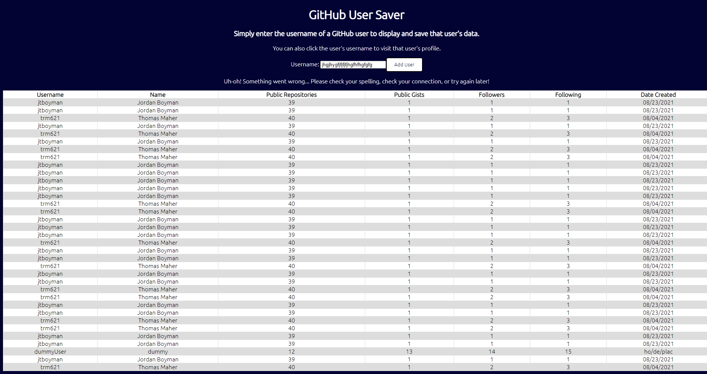

  # GitHub User Saver
  

  ## Table of Contents:
  * [Description](#description)
  * [Installation](#installation)
  * [Usage](#usage)
  * [Development](#development)
  * [Contributors](#contributors)
  * [Questions](#questions)
  
  ## Description:
  The GitHub User Saver is an app developed per the request of CDW that takes in a GitHub username, makes a call the the GitHub API for that user's information, and saves it to a Google FireStore database. The saved information is then rendered in a neat table with a link to that user's profile page.
  

  ## Installation:
  In order to run the app, ensure that you have installed node.js on your machine.
  - In the command line, run `git clone https://github.com/jtboyman/jtboyman-github-user-saver2.git` to clone the app onto your machine.
  - In the command line, run `cd github-user-saver2` to navigate to the directory.
  - In the command line, run `npm i` to install the necessary dependencies.
  - Run `npm start` to run the development build of the app.
  - The app will be available at in the browser at http://localhost:3000.
  - To create a production build, you can use `npm run build`.

  ## Usage:
  In order to use GitHub User Saver, simply enter the username of a GitHub user into the search bar and "Add User". The user will be added to the saved list along with their GitHub information. Click on the user's username to visit that user's GitHub profile. 
    

  ## Development

  ### Architecture
  In building this app, I decided to model the structure as similarly as possible to other React projects I have worked on. As such, I started with a subdirectory for pages. Because a small scale app such as this would only require one page, I moved on to breaking down the components: the searchbar/form component that users would enter their queries into and the list of saved data. Then I created a subdirectory I named "services", which would be responsible for making the needed calls to the database. This app only POSTs data and GETs data, but separating the services into a separate folder made sense in terms of the potential for scaling, should later the app require full CRUD services from FireStore. Originally, the services subdirectory had another file that exported a `getUsers()` function, but this export was removed and the code was placed directly into the User List component due to difficulties with formatting. I included a utils subdirectory that houses a date formatting function in order to set the date in the desired format; again, as the app could potentially scale, it's important to separate out concerns in this way so that this function could be used elsewhere and does not add confusion to another file. Finally, I chose to separate out the connection to Google FireBase, credentials, etc. This again separates out this module and maintains neatness and readability of components, as well as helping to keep the code DRY.

  ### Challenges
  A major challenge in this creating this application was my unfamiliarity with TypeScript as well as Google FireStore. Google FireStore was an exciting resource to explore; the ability to very quickly get a database up and running is incredibly valuable. The documentation was simple to navigate, and I was able to find many resources online to help get the database set up quickly and start making calls and writing data to it right away. At first, I used `getDocs` to fetch the information from the database, but upon realizing this only made the call once, and the user would have to refresh the page to view new information, I looked into how to get the page to update in realtime. `onSnapshot` makes this very easy, and after some research I was able to incorporate it. I struggled at first with how to actually obtain the data `onSnapshot` was collecting, but I after looking back at some previous projects of mine, I realized React's `useEffect` and `useState` would allow me to capture and update these changes dynamically.

  TypeScript seemed like it would be a simple transition from vanilla JavaScript, but I found I had a more trouble with it than I thought I would. In `add-user.ts`, I kept running into errors when using `document.querySelector`, which resulted in my learning how to correctly decalre type using the `as` keyword. Similarly, I had trouble once again figuring out the correct syntax for declaring the type of the array of objects fetched from the database. With some research, as well as trial and error, I was able to better get an understanding of what TypeScript required and why. I took for granted the amount of work JavaScript does in inferring types. I better understand the value of TypeScript as a strongly typed language, and how it can ensure correct code and prevent errors. I feel it's especially important when using a database such as Google FireStore where there is not the need for schemas, models, etc.

  A final challenge worth mentioning briefly was figuring out where exactly to start. I set up a repository that I ended up scrapping because I did not take the time I needed to organize before jumping directly into coding. I wanted to quickly get feet wet with the new technologies, and the first repo certainly worked as a good learning experience. However, once I sat down and made a coherent, thoughtful plan, development was able to progress much more smoothly. Having a strong plan and management of time was vital in making sure I was able to complete the project within the timeframe while still working fulltime at my current position.

  ### Roadmap
  In reflection on this project, there are a few features and practices I would have liked to incorporate, and should work continue on this project, I will definitely move forward with:
  - Unit Testing: The importance and value of unit testing should not be overlooked. My next steps would be to better familiarize myself with Jest, so that I can use the limited knowledge I do have to better support future projects with this often overlooked, but incredibly useful practice.
  - Preventing Duplicated Users: Setting up the app to notify users a user has already been saved would create a better user experience. Adding some sort of check into `add-user.ts` would be helpful.
  - Mobile Responsiveness: The app is usable on various screen sizes, but media queries added into the css file could better support users on different platforms.
  - Organization of Added Users: It is a more intuitive user experience if there is a more predictable way users are added to the user list; figuring out a way to get FireStore to organize added data more consistently would be helpful.
  - GitHub branches/commits: With more ideas on how to structure the app and where to begin, in retrospect I would have liked to make better use of GitHub's branches to add features in a more organized way (e.g. a branch for setting up Firebase, a branch for setting up React components, etc.). Additionally, making more commits along the way would help in both organization and safety. It is also good practice for working with other developers. While descriptive, there definitely could have been more commits.
  

  ## Contributors
  Thank you to all reviewers for your consideration. I'm looking forward to any and all feedback, and am more than happy to make any edits if afforded the opportunity. Any other contributors feel free to open issues on GitHub or reach out via email.
  

  ## Questions
  You can reach me for additional questions at:
  * GitHub: [jtboyman](https://github.com/jtboyman)
  * Email: jtboyman@gmail.com
